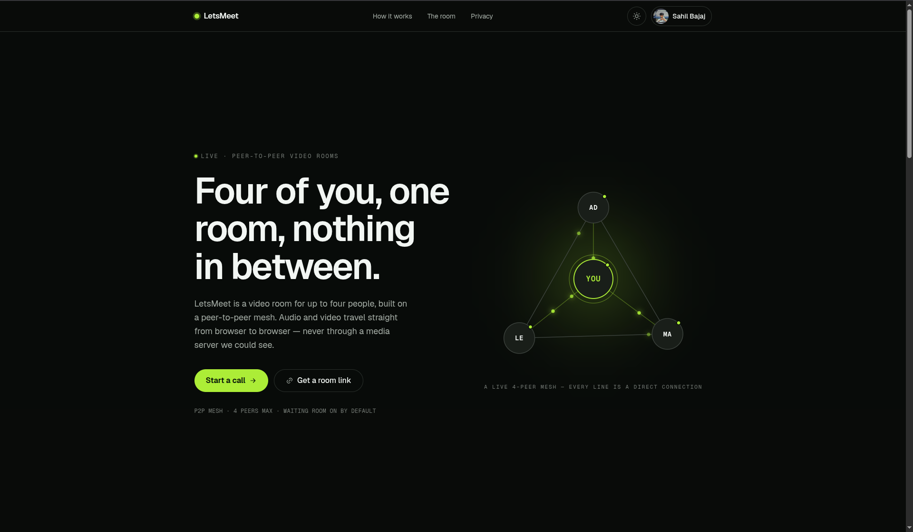

# 📹 LetsMeet — Peer-to-Peer Video Rooms

<p align="center">
  
</p>

<p align="center">
  <a href="https://bajajletsmeet.vercel.app/"><strong>🌐 Live App</strong></a> ·
  <a href="https://letsmeet-9ihi.onrender.com"><strong>⚡ Backend (Wake it up)</strong></a>
</p>

<p align="center">
  
  
  
  
  
  
</p>

---

## 🔍 Overview

**LetsMeet** is a private, peer-to-peer video calling app for up to **4 people** — no media server in the middle. Audio and video travel straight browser-to-browser via WebRTC. Sign in with Google to host; guests join with just a display name. Every joiner waits in a lobby until the host lets them in.

- 🟢 **Zero media server** — WebRTC P2P mesh, your video never touches a server
- 🔐 **Waiting room by default** — host approves every join, no surprise drop-ins
- 👑 **Host controls** — mute, kick, or end the call for everyone
- 🖥️ **Screen share** — one person at a time, auto-reverts when you stop sharing
- 👤 **Guest-friendly** — no account needed to join, just type a name
- 🔗 **Shareable links** — one link, anyone can knock

> ⚠️ **Backend note:** The signaling server is on Render's free tier and may be sleeping.
> If the app doesn't connect, [click here to wake it up](https://letsmeet-9ihi.onrender.com), then refresh the page.

---

## 🏗️ Architecture

Two separately deployed services — this split is intentional. Vercel's serverless functions can't hold the persistent Socket.io connection the signaling server needs.

```
┌──────────────────────────┐         ┌──────────────────────────┐
│  Next.js Frontend        │  socket │  Signaling Server        │
│  bajajletsmeet.vercel.app│◀───────▶│  letsmeet-9ihi.onrender  │
│  App Router · UI · Auth  │   .io   │  Express + Socket.io 4   │
└───────────┬──────────────┘         └────────────┬─────────────┘
            │ Mongoose                             │ Mongoose (read-only)
            ▼                                      ▼
      ┌─────────────────── MongoDB Atlas ────────────────────┐
      │  users · rooms (TTL index → auto-expire)             │
      └──────────────────────────────────────────────────────┘

  Audio / video / screen share → peer ⇄ peer via WebRTC
  It never touches either server or the database.
```

---

## ✨ Features

### 🔑 Authentication
- Sign in with Google — no email/password anywhere
- Session persists across visits (NextAuth.js)
- Logged-in users show full name + Google avatar; guests show typed name only

### 🏠 Room Management
- Only logged-in users can **create** a room
- Generates a unique code + shareable link
- Room **auto-expires** and deletes from MongoDB via TTL index — no manual cleanup
- Anyone can check a code: valid / expired / not found

### 🚪 Waiting Room (everyone waits — logged in or guest)
- Every joiner enters a lobby first
- Host sees live "X wants to join" notifications
- Host accepts or declines each individually
- Declined users can't rejoin the same session

### 👑 Host Controls

| Action | Description |
|---|---|
| ✅ Accept / ❌ Decline | Approve or reject waiting room requests |
| 🔇 Mute participant | Force-mute any participant's mic |
| 🚪 Kick participant | Remove anyone from the call |
| ☠️ End call for all | Terminate the room for every participant at once |

### 🎛️ Member Controls (everyone has these)
- Mute / unmute own mic
- Turn own camera on / off
- Leave the call individually (doesn't affect others)

### 🖥️ Screen Share
- Available to all participants — no host gate
- Only **one person** can share at a time (enforced via Socket.io broadcast)
- Native browser "Stop sharing" button detected via `track.onended` — auto-reverts to camera

### 🔒 Capacity
- Max **4 participants** per room (P2P mesh limit)
- 5th joiner gets "room full" — no lobby entry offered

---

## 🛠️ Tech Stack

| Concern | Technology |
|---|---|
| Frontend | Next.js 14 (App Router, JSX) |
| Styling | Tailwind CSS v4 |
| Auth | NextAuth.js v4 — Google OAuth only |
| Database | MongoDB Atlas + Mongoose (TTL index on rooms) |
| Signaling | Node.js + Express 5 + Socket.io 4 (ESM) |
| Media | Native WebRTC (`RTCPeerConnection`, `getUserMedia`, `getDisplayMedia`) |
| NAT Traversal | STUN (Google public) + optional TURN |
| State | Zustand (frontend call state) |
| Frontend Deploy | Vercel |
| Signaling Deploy | Render |

---

## 🚀 How a Call Works

```
1. CREATE   →  Host signs in, clicks "New Room" → gets a code + shareable link
2. SHARE    →  Host shares the link with up to 3 others
3. KNOCK    →  Guests open the link, enter a name (or sign in), click "Join"
4. LOBBY    →  Host sees "X wants to join" — clicks Accept or Decline
5. CONNECT  →  WebRTC handshake relayed through Socket.io (offer / answer / ICE)
6. CALL     →  Audio & video flow peer-to-peer — server is out of the loop
7. LEAVE    →  Anyone can leave; host can kick or end call for all
```

---

## 🖥️ Running Locally

You need **two terminals** — frontend and signaling server run as separate processes.

### Prerequisites
- Node.js ≥ 20.9
- MongoDB Atlas cluster (or local `mongod`)
- Google OAuth credentials — Web app type, redirect URI: `http://localhost:3000/api/auth/callback/google`

### 1. Clone

```bash
git clone https://github.com/your-username/letsmeet.git
cd letsmeet
```

### 2. Frontend env — `.env.local` (repo root)

```bash
GOOGLE_CLIENT_ID=...
GOOGLE_CLIENT_SECRET=...
NEXTAUTH_SECRET=...            # openssl rand -base64 32
NEXTAUTH_URL=http://localhost:3000
MONGODB_URI=mongodb+srv://...
NEXT_PUBLIC_SIGNALING_URL=http://localhost:4000

# Optional TURN (needed for strict/corporate networks)
# NEXT_PUBLIC_STUN_URLS=stun:stun.l.google.com:19302
# NEXT_PUBLIC_TURN_URL=
# NEXT_PUBLIC_TURN_USER=
# NEXT_PUBLIC_TURN_CRED=
```

### 3. Signaling env — `signaling/.env`

```bash
PORT=4000
CLIENT_ORIGIN=http://localhost:3000
MONGODB_URI=mongodb+srv://...   # same cluster; signaling is read-only
```

### 4. Install

```bash
npm install                     # frontend (repo root)
cd signaling && npm install && cd ..
```

### 5. Start

```bash
# Terminal 1 — signaling server on :4000
cd signaling && npm start

# Terminal 2 — Next.js on :3000
npm run dev
```

Open [http://localhost:3000](http://localhost:3000).

---

## 📁 Project Layout

```
app/
  api/auth/[...nextauth]/   NextAuth Google OAuth route
  api/rooms/                Create + validate room endpoints
  room/[code]/              Room page, call UI, WebRTC hook
  _components/              All UI components (nav, lobby, video tiles…)
  dashboard/                Post-login dashboard
lib/                        Auth helpers, MongoDB client, ICE config, room utils
models/                     Mongoose schemas — User, Room (TTL index)
signaling/                  Separate Express + Socket.io service
  lib/                      DB connection, room registry + state machine
  models/                   Read-only Room model
public/                     Static assets (App.png, etc.)
```

---

## 🌐 Deployment

| Service | Platform | URL |
|---|---|---|
| Frontend (Next.js) | Vercel | [bajajletsmeet.vercel.app](https://bajajletsmeet.vercel.app/) |
| Signaling (Socket.io) | Render | [letsmeet-9ihi.onrender.com](https://letsmeet-9ihi.onrender.com) |
| Database | MongoDB Atlas | Private |

> Render's free tier spins down after inactivity. If the app hangs on connecting,
> [visit the backend URL](https://letsmeet-9ihi.onrender.com) to wake it up, then refresh.

---

## 🚫 Out of Scope (v1)

- No email/password login — Google only, always
- No in-call text chat
- No call recording
- No virtual backgrounds or live captions
- No simultaneous multi-person screen share (one at a time)
- No SFU/media server — raising past ~4–6 participants would require LiveKit or mediasoup (a different architecture entirely)
- No breakout rooms

---

## 👨‍💻 Author

Built by **Sahil Bajaj**

📧 [sahilbajaj2004@gmail.com](mailto:sahilbajaj2004@gmail.com)

---

<p align="center">Made with ☕ and WebRTC</p>
